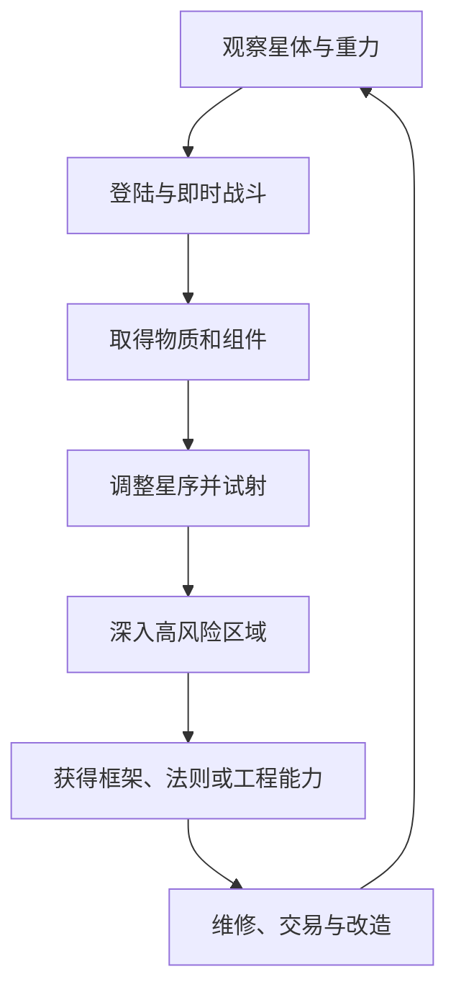

# 《坠星余烬》核心玩法系统设计

> 版本：V0.2 草案  
> 上游基线：《游戏设计总纲 V0.5》《00_阅读说明与冻结基线》  
> 替代范围：V0.1 中的战斗主干、星种构筑、打击反馈、原型范围与开发优先级  
> 保留范围：重力、物质、生命、飞船、知识成长与回响接续的基础方向  
> 排除范围：剧情文本、角色弧线、势力立场、星球篇章和结局演出

---

## 0. V0.2 修订结论

V0.1 已经说明星种可以承担战斗、移动、采矿、炼金与世界改造，但仍存在两个根本问题：

1. 星种更像“配方生成的物理物体”，没有形成类似《Noita》法杖的顺序执行、作用域、触发、嵌套与递归。
2. 普通攻击偏向投掷重物、布置机关和等待反应，缺乏即时的瞄准、开火、飞行、命中与连续射击快感。

V0.2 将核心系统重构为三层：

```text
动作射击主干
    ↓
星铸执行语言
    ↓
真实物质、局部重力与环境反应
```

- **动作射击主干**保证游戏在没有复杂构筑、没有环境材料时也能成立。
- **星铸执行语言**提供顺序、修饰、调度、触发、作用域、嵌套和递归产生的组合深度。
- **物质与重力模拟**让同一条星序在不同环境中产生不同后果，并把攻击结果留在世界中。

最终目标不是复制法杖系统，而是形成：

> **星铸编程语言 × 射击手感 × 真实质量 × 局部重力 × 物质反应。**

---

## 1. 核心设计支柱

### 1.1 空场射击也必须好玩

不考虑材料反应、敌人弱点和复杂构筑时，玩家使用初始星铸器射击墙壁、移动靶与普通敌人，仍应感到响应迅速、节奏稳定、命中明确。

> 如果在空房间连续射击三十秒都不好玩，物质系统不会自动补足手感。

### 1.2 普通战斗先允许射击，再奖励理解

基础射击可以正常击杀杂兵。材料知识应让玩家打得更快、更安全、更夸张，而不是让每个普通敌人都变成一道化学题。

### 1.3 星种是连续成长状态

高速射击与微型天体不是两套系统。每一发高速弹体都是尚未成熟的星种，只是多数星种会在成熟前命中、破裂、耗尽或触发子星序。

### 1.4 构筑首先改变行为

组件的首要价值是改变：

- 什么时候释放；
- 释放多少；
- 以何种轨迹运动；
- 在什么事件发生时继续执行；
- 对哪一个对象或子星种生效；
- 物质如何留在环境中。

纯粹的“伤害＋10%”不作为独立核心组件。

### 1.5 环境负责变异，不负责准入

一套合格构筑应有约七成基础性能来自星铸器自身，环境提供约三成增强、转化与意外后果。缺少某种环境材料时，构筑可以减弱，但不能完全失效。

### 1.6 缺陷可以成为资源

低稳定、泄漏、过载、乱序、后坐力和材料污染必须存在可利用路线。高阶构筑的风险应尽量可预测、可转移、可触发，而不是纯随机惩罚。

### 1.7 成长不依赖等级压制

继续不设置人物等级与经验值。成长来自：

- 玩家掌握的规则；
- 当前取得的星铸器框架与组件；
- 当前携带的物质；
- 飞船与世界工程状态；
- 法则见证提供的本局语法扩展。

---

## 2. 整体玩法循环

### 2.1 宏观循环



### 2.2 单次战斗循环

普通遭遇遵循：

```text
瞄准 → 开火 → 命中 → 状态与材料残留 → 继续射击或切换构筑
```

复杂遭遇在此基础上增加：

```text
观察材料与器官
→ 用基础射击制造窗口
→ 利用地形、状态或星序触发连锁
→ 控制失稳和后坐力
→ 回收残骸与生成物
```

玩家不应在每次交战前被迫停下来阅读材料面板。观察与射击可以同时发生。

### 2.3 三种处理层级

| 层级 | 方式 | 适用对象 |
|---|---|---|
| 直接处理 | 连射、霰射、蓄力、流束 | 杂兵、受伤目标、紧急自卫 |
| 状态处理 | 加热、冷却、充电、腐蚀、覆盖 | 特性敌人、精英、装甲结构 |
| 世界处理 | 放水、泄压、改重力、坍塌、生态增殖 | 首领、地形难题、大型工程 |

三者共享同一套星种与物质规则，但操作节奏不同。

---

## 3. 操作、移动与重力

### 3.1 基本操作结构

| 操作 | 功能 |
|---|---|
| 移动 | 沿当前稳定表面的切线移动 |
| 跳跃／脱离 | 施加短促离面速度，低重力下可能进入弹道或轨道 |
| 推进 | 消耗推进能量，持续修正速度方向 |
| 瞄准 | 独立于移动方向，星铸器与上身朝向瞄准点 |
| 开火 | 连续读取当前星铸器的星序 |
| 次级操作 | 根据当前构筑执行蓄力、主动触发、回收或引爆 |
| 快捷切换 | 在三件星铸器之间切换 |
| 扫描 | 显示已经验证的物质、温度、电荷、坠性与反应事实 |

三个快捷槽不再固定为“战斗、移动、工具”。这只作为新手预设；任意星铸器都可以跨用途构筑。

### 3.2 镜头与当前下方

- 镜头以玩家当前主要重力方向为目标，平滑旋转，使当前“下方”逐渐落到屏幕下方。
- 局部星种引力只影响玩家运动，不应让镜头对每次微小扰动剧烈旋转。
- 当两个重力源接近时，镜头依据玩家脚部接触、主要加速度和锁定迟滞选择参考方向。
- 完全失重时镜头保持最后稳定方向，玩家可以主动重新校准。
- 重力翻转必须由液体、尘埃、角色姿态、背景弧线与声音共同提示。

### 3.3 推进能量基准

沿用首轮基准：

| 参数 | 数值 |
|---|---:|
| 最大推进能量 | 100 |
| 连续推进消耗 | 35／秒 |
| 稳定地面恢复 | 22／秒 |
| 真空中恢复 | 8／秒 |

推进不是无限飞行，而是轨迹修正、躲避、重新落地与低重力战斗工具。

### 3.4 射击后坐力

后坐力分为两层：

| 层级 | 作用 |
|---|---|
| 表现后坐力 | 星铸器摆动、角色姿态、准星扩张、镜头微动 |
| 真实后坐力 | 改变玩家速度与轨道 |

高速低质量幼种只有很小的真实后坐力，保证常规连射成立。增重、多重施放、排斥核心、蓄力释放和过载才显著推动玩家。

---

## 4. 射击主干

### 4.1 基础枪感指标

以下为首轮调试区间，不是最终平衡值：

| 指标 | 建议区间 |
|---|---:|
| 输入至释放延迟 | 50ms以内 |
| 连射型铸造间隔 | 0.09～0.14秒 |
| 高速幼种速度 | 每秒约3～5个屏幕宽度 |
| 高速幼种寿命 | 0.4～0.8秒 |
| 普通敌人合理击杀时间 | 0.5～1.2秒 |
| 普通命中局部停顿 | 20～35ms |
| 强击／破甲局部停顿 | 40～65ms |

命中停顿优先作用于受击对象、攻击动画和局部特效，不冻结整套物质模拟。

### 4.2 四段射击反馈

#### 释放

- 星铸器向瞄准方向快速摆动；
- 出现2～3帧压缩与喷出闪光；
- 释放声具有稳定主体音；
- 连射时动画与声音形成可预期节拍；
- 高质量释放增加低频、火花与身体反作用。

#### 飞行

- 高速幼种具有清晰短尾迹；
- 尾迹长度表达速度，宽度表达质量；
- 温度、电荷、低稳定和材料泄漏改变尾迹形态；
- 飞过液体、气体和尘埃时留下扰动；
- 轨迹受到重力影响，但普通射击在常见距离内仍可瞄准。

#### 命中

- 受击部位闪亮或反色1～2帧；
- 撞击点喷出敌人实际身体材料；
- 敌人产生方向一致的击退或局部变形；
- 命中声与释放声分离；
- 准星产生极短的收缩反馈；
- 生命、裂纹、外壳或器官状态立即改变。

#### 死亡与残骸

- 金属体留下导电碎片；
- 液态体失去聚合并沿重力流散；
- 菌类释放菌丝、孢子或可燃气体；
- 高温体泄压、冷却或碎裂；
- 太空生物喷出体液并改变残骸运动。

死亡反馈同时产生下一轮战斗可以使用的材料。

### 4.3 声音结构

每次攻击至少包含三层声音：

```text
铸造声 → 飞行声 → 命中／破裂声
```

- 连射主体音保持一致，只对音高、尾音和材质层做小幅随机。
- 命中不同材料使用不同撞击层：金属、岩石、液体、血肉、玻璃与菌膜应可听辨。
- 强击通过低频、瞬时静音和残响体现，不单纯提高音量。
- 失稳前应形成可学习的声音预兆。

### 4.4 基础射击与环境的关系

基础星序自带少量种子物质，可以在任何普通环境启动。环境吸附负责：

- 增加质量；
- 改变覆盖和状态；
- 生成新的导电、燃烧或腐蚀路径；
- 延长星种寿命；
- 令幼种成长为成种；
- 引入额外风险。

环境不负责决定玩家是否有最基本的攻击能力。

---

## 5. 星种的三个时间尺度

星种不是三种不同武器，而是同一对象随质量、稳定度、供料和寿命变化形成的三个状态。

| 状态 | 暂定判定 | 典型寿命 | 主要玩法 |
|---|---|---:|---|
| 高速幼种 | 低质量、高初速、弱独立引力 | 0.1～1秒 | 连射、霰射、穿透、触发、流束 |
| 活性成种 | 中等质量、可持续吸附与执行 | 1～15秒 | 环绕、追踪、护盾、持续放电、区域控制 |
| 天体化星种 | 高质量、自持轨道或循环 | 15秒以上 | 采矿、生态、飞船、长期设施和世界改造 |

### 5.1 状态转换

幼种可以通过以下方式成长：

- 环境吸附；
- 主动投料；
- 增重或延寿组件；
- 与其他幼种合并；
- 吞噬尸体或结构材料；
- 在轨道中持续获得核力。

成种可以通过以下方式天体化：

- 达到质量阈值；
- 建立稳定轨道；
- 出现自持物质循环；
- 安装长期引核；
- 通过法则见证或星炼稳定。

绝大多数普通攻击会在幼种阶段结束，从而保持射击节奏。

### 5.2 结束方式

星种可以：

- 寿命耗尽并散解；
- 碰撞破裂；
- 穿透后继续飞行；
- 触发内部子星序；
- 被主动回收；
- 因失稳泄漏或坍缩；
- 留在世界中成为物质实体。

---

## 6. 星铸执行语言

### 6.1 从配方改为程序

V0.1 的 `[核][质][形][律][触][连]` 不再作为六个固定配料槽，而改为组件的世界规则标签。

玩家实际构筑的是一条从左向右执行的“星序”。星铸器每次启动读取组件，累积修饰和触发结构，直到遇到载荷组件并生成星种。

### 6.2 基础执行规则

1. 执行指针从最左侧开始。
2. 修饰组件进入当前修饰栈。
3. 调度组件改变下一项或下一组的执行次数、顺序和间隔。
4. 触发组件把一个子星序附着到下一枚载荷。
5. 作用域组件决定修饰针对下一项、下一组、当前星种或子星种。
6. 遇到载荷时，星铸器消耗兼容修饰并生成星种。
7. 载荷携带的触发条件满足后，从子星序首项开始执行。
8. 读取到末尾后进入回炉时间，再从首项开始下一轮。

### 6.3 机械组件类型

| 类型 | 作用 | 示例 |
|---|---|---|
| 载荷 | 生成星种、物质或结构 | 岩核幼种、水幼种、铁砂幼种、空壳 |
| 修饰 | 改变下一载荷或作用域 | 加速、增重、缩小、加热、充电、穿透 |
| 调度 | 改变数量、顺序和时间 | 双生、三联、交替、重复、延时 |
| 触发 | 把子星序附着到事件 | 碰撞触发、破裂触发、失稳触发、离场触发 |
| 作用域 | 决定修饰对象和边界 | 下一项、下一组、所有子星种、当前循环 |
| 控制 | 改变已生成星种行为 | 直射、追踪、环绕、返回、主动引爆 |

“核、质、形、律、触、连”仍存在于组件信息中。例如铁砂幼种拥有：

- 引核：微弱吸引；
- 物质：铁砂；
- 形态：紧束颗粒；
- 法则：导电、磁化、高质量；
- 可用触发：碰撞、破裂、过载；
- 可被连接：子星种、环绕物、回收目标。

### 6.4 星序示例

```text
双生
→ 加速
→ 碰撞触发 [
    三联
    → 加热
    → 水幼种
  ]
→ 铁砂幼种
```

执行结果：

1. 双生令下一枚载荷生成两份；
2. 加速进入修饰栈；
3. 碰撞触发把括号内星序附着到下一枚载荷；
4. 星铸器生成两颗高速铁砂幼种；
5. 每颗铁砂幼种命中后执行子星序；
6. 子星序分别生成三颗加热水幼种；
7. 水幼种与环境、敌人和高温残留继续反应。

调换顺序会改变结果：

```text
加速
→ 铁砂幼种
→ 双生
→ 水幼种
```

这会先生成一颗高速铁砂幼种，再生成两颗普通水幼种，不再存在碰撞触发。

### 6.5 嵌套与递归限制

嵌套和递归是后期深度来源，但必须受到框架参数约束：

- 指令深度限制触发嵌套层数；
- 单次执行预算限制一轮最多生成的星种数；
- 质量通量限制真实物质生成速度；
- 核力限制持续连射；
- 稳定度决定超限后如何失败；
- 同时存在上限限制持续型星种数量。

系统应阻止无限无成本递归，但允许玩家通过回收、延迟、命中返核和环境供料构成近似循环。

---

## 7. 星铸器框架

星铸器不是单纯的槽位容器，而是执行星序的机器。

### 7.1 框架参数

| 参数 | 影响 |
|---|---|
| 执行模式 | 顺序执行或乱序执行 |
| 星序容量 | 可安装组件数量 |
| 每轮读取数 | 每次启动读取多少组件或载荷 |
| 铸造间隔 | 同一轮内部各次释放的间隔 |
| 回炉时间 | 读完整轮后的恢复时间 |
| 核力容量 | 一轮可支付的总消耗 |
| 核力恢复 | 连续使用能力 |
| 质量通量 | 单位时间可生成和控制的质量 |
| 指令深度 | 允许的触发、嵌套和递归层数 |
| 同时存在上限 | 可维持的活性成种数量 |
| 稳定方式 | 超载后的泄漏、跳序、逆转或坍缩倾向 |

### 7.2 框架原型

| 框架 | 优势 | 缺陷 | 适合方向 |
|---|---|---|---|
| 快速顺序型 | 铸造间隔短、顺序稳定 | 质量通量低、槽位少 | 连射、流束、触发链 |
| 高质量慢速型 | 质量通量高、稳定 | 回炉慢、后坐力大 | 蓄力、采矿、重型撞击 |
| 低稳定递归型 | 指令深度高、核力恢复快 | 容易泄漏和提前触发 | 子星种、循环、失稳构筑 |
| 高属性乱序型 | 容量与核力优秀 | 组件顺序不可靠 | 同质载荷、混沌反应、赌博构筑 |

### 7.3 三件星铸器

玩家仍可携带三件常用星铸器，但不设硬性用途：

- 可以配置成连射、蓄力和工具；
- 也可以配置成三把战斗器；
- 可以把移动、攻击和采矿写入同一条星序；
- 快捷切换不暂停世界；
- 完整编辑原则上需要安全环境、飞船或特殊能力。

---

## 8. 稳定度、过载与缺陷构筑

### 8.1 稳定度后果

沿用V0.1的分级方向：

| 超出稳定负荷 | 基础后果 |
|---:|---|
| 1～15 | 轨迹抖动、散布扩大 |
| 16～30 | 物质泄漏、修饰衰减 |
| 31～50 | 跳序、提前触发、脱离控制 |
| 51以上 | 核心坍缩、反向吸引、爆炸或大规模散解 |

后果必须由框架的稳定方式和具体组件决定，尽量避免完全随机。

### 8.2 利用缺陷的组件

| 组件 | 效果 |
|---|---|
| 泄漏收束 | 把泄漏物质变成环绕碎片 |
| 逆坠接续 | 重力反转时重复上一载荷 |
| 过载分裂 | 核力不足时生成两个残缺幼种 |
| 裂核触发 | 星种失稳时执行附着子星序 |
| 末项回响 | 被跳过的组件在星种死亡时执行 |
| 坍缩回收 | 坍缩时返还部分核力并吸入周围材料 |

高稳定意味着可靠，低稳定意味着更高上限与新的语法入口，而不是简单品质差异。

---

## 9. 基础射击构筑家族

以下是同一套组件自然形成的行为家族，不是固定武器职业。

### 9.1 连射型

```text
加速 → 穿透 → 铁砂幼种
```

- 稳定、快速、适合普通战斗；
- 环境铁砂会增加质量与后坐力；
- 充电后可转为导电射击；
- 加入命中返核后可维持更长连射。

### 9.2 霰射型

```text
五联 → 散布 → 碰撞破裂 → 水幼种
```

- 近距离形成密集命中；
- 水覆盖为后续电击创造条件；
- 加热修饰可令命中点产生蒸汽冲击；
- 在低重力中散布也会产生明显反向推力。

### 9.3 精确蓄力型

```text
蓄积 → 高速 → 增重 → 击穿 → 岩核幼种
```

- 长按积累质量和核力，松开释放；
- 强命中具有明显停顿、裂纹与碎片反馈；
- 可以击穿装甲和脆弱地层；
- 过度蓄积可能把玩家推离表面。

### 9.4 流束型

```text
连续读取 → 极低质量 → 追随瞄准 → 光晶幼种
```

- 由大量短寿命幼种形成视觉连续流；
- 能够持续加热、充电或推动轻物质；
- 不使用无质量的抽象激光；
- 环境尘埃会让流束轨迹可见并发生偏折。

### 9.5 环绕型

```text
延寿 → 环绕自身 → 铁砂幼种
```

- 幼种成长为活性成种；
- 既能拦截弹体，也能切割靠近者；
- 主动释放时可沿切线投射；
- 质量过高会提高移动负担和失控风险。

### 9.6 重型物理型

```text
增重 → 吸附岩石 → 延时释放 → 岩核幼种
```

- 初期像投石器，后期可以成长为轨道巨物；
- 适合地形破坏、首领和世界工程；
- 不作为唯一核心战斗手感；
- 负责保留项目原有的重物、爆炸和天体构筑玩法。

---

## 10. 战斗与敌人

### 10.1 敌人解题强度分层

| 层级 | 基础射击 | 深层规则 |
|---|---|---|
| 杂兵 | 可快速击杀 | 利用材料可节省核力或制造连锁 |
| 特性敌人 | 正常有效 | 使用针对状态明显更快 |
| 精英 | 可以造成伤害但效率较低 | 需要破坏器官、外壳或环境连接 |
| 首领 | 用于制造窗口与处理阶段 | 需要结合材料、地形、重力和星序 |

### 10.2 身体结构

| 层级 | 示例 | 破坏结果 |
|---|---|---|
| 核心 | 神经节点、反应器、生命囊 | 失去主要能力或进入濒死状态 |
| 外壳 | 金属、岩壳、冰壳、菌膜 | 抗性变化并暴露内部材料 |
| 运动器官 | 喷口、触须、翅膜、腿部 | 速度、轨迹与攻击方式改变 |
| 环境连接 | 热源、巢穴、导电线、液体源 | 阻断治疗、修复、召唤或特殊攻击 |

普通敌人只需一至两个明显层级，精英和首领才使用完整结构。

### 10.3 基础敌人行为类型

| 类型 | 行为 | 可选处理 |
|---|---|---|
| 爬行体 | 依附地表近战追击 | 连射击退、破坏接触面、改变重力 |
| 喷射体 | 喷出高温、酸或孢子 | 射击喷口、冻结弹药、反向利用射流 |
| 聚群体 | 小个体合并和包围 | 霰射、流束、燃烧或切断繁殖源 |
| 装甲体 | 正面防护高、转向慢 | 蓄力击穿、腐蚀、磁化或攻击背部 |
| 液态体 | 分流并重新聚合 | 持续射击压制、冻结、污染或封堵 |
| 雷电体 | 沿导电网络移动 | 断路、绝缘或把电荷导入星种 |
| 轨道体 | 在低重力中持续变轨 | 高速拦截、追踪幼种、局部重力 |
| 寄生体 | 附着地形和其他生物 | 精确射击连接点、加热或剥离宿主 |

### 10.4 首领原则

首领至少由三类难点构成：

- 材料状态变化；
- 可破坏器官；
- 环境压力；
- 重心和轨道变化；
- 射击与世界处理切换；
- 死亡后的残骸危机。

首领不能依靠生命膨胀延长战斗。基础射击负责持续压迫、打断和制造窗口，复杂星种负责阶段破解和环境改造。

### 10.5 输出基准

沿用V0.1作为远期参考：

| 构筑阶段 | 合理持续输出 |
|---|---:|
| 初始 | 10～20／秒 |
| 前期成型 | 25～50／秒 |
| 中期 | 60～150／秒 |
| 后期 | 200～500／秒 |
| 极端构筑 | 1000以上，并伴随显著自毁风险 |

具体数值必须在射击主干完成后重新标定，不在原型前锁死。

---

## 11. 生命、伤害与状态

### 11.1 玩家基础状态

| 属性 | 初始基准 | 规则 |
|---|---:|---|
| 生命 | 100 | 归零死亡，无被动恢复 |
| 推进能量 | 100 | 用于空中和太空轨迹修正 |
| 温度 | 随环境变化 | 影响伤害、移动、脆性与材料状态 |
| 电荷 | 0～100 | 高值导致暴露、僵直、设备干扰和放电 |
| 物质覆盖 | 百分比 | 影响燃烧、导电、腐蚀、感染与降温 |
| 重力压迫 | 随G值和时间累计 | 影响运动和身体完整性 |

不设置固定的第二护甲条。护盾、外壳和装甲由真实材料或星种产生，可以被击碎、熔化、导电、腐蚀和回收。

### 11.2 伤害包

```text
伤害包 = 生命伤害 + 冲量 + 温度变化 + 电荷变化 + 覆盖变化 + 反应标签
```

射击命中必须至少产生生命伤害、冲量或材料剥离中的一项，不能只有数字跳动。

### 11.3 伤害来源

| 来源 | 主要结果 |
|---|---|
| 动能 | 伤害、击退、破壳、改变轨道 |
| 热 | 加热、燃烧、熔化、压力变化 |
| 压力 | 推动、挤压、失压、结构破坏 |
| 电荷 | 僵直、电弧、设备干扰 |
| 腐蚀 | 持续削弱材料和地形 |
| 生物 | 感染、增殖、同化和覆盖 |
| 坠性 | 改变重力响应、方向和落点 |

这些是物理来源标签，不是七种颜色属性伤害。

### 11.4 温度基准

| 温度 | 效果 |
|---:|---|
| -30～80℃ | 舒适区 |
| 80～160℃ | 每秒约2点热伤害 |
| 160～400℃ | 每秒约8点热伤害 |
| 400℃以上 | 每秒约25点并开始熔化 |
| -30～-80℃ | 移动和推进减慢 |
| -80～-150℃ | 身体变脆，动能伤害提高 |
| -150℃以下 | 冻结，强撞击可能碎裂 |

### 11.5 电荷与覆盖基准

| 状态 | 阈值 | 后果 |
|---|---:|---|
| 电荷 | 35～59 | 出现电弧并暴露位置 |
| 电荷 | 60～99 | 僵直并干扰金属装备 |
| 电荷 | 100 | 放电并受到伤害，电荷回落 |
| 水覆盖 | 20% | 不易燃，但导电显著提高 |
| 油覆盖 | 15% | 达到燃点后持续燃烧 |
| 酸覆盖 | 10% | 持续腐蚀身体与装备 |
| 血液覆盖 | 25% | 吸引部分生物和孢子 |
| 冷凝胶覆盖 | 30% | 快速降温但移动减慢 |
| 菌丝覆盖 | 50% | 感染并改变部分星种行为 |

### 11.6 治疗

| 来源 | 效果 | 限制 |
|---|---|---|
| 稳定避难设施 | 完全恢复并清除主要状态 | 数量有限 |
| 活性凝胶 | 20秒内恢复约25点 | 可能感染或吸引生物 |
| 修复晶体 | 立即恢复约15点 | 稀有或不可再生 |
| 治疗星序 | 通过构筑生成恢复物质 | 消耗组件并带有副作用 |

普通敌人不大量掉落即时治疗，避免用击杀数量换取无限续航。

---

## 12. 物质与反应

### 12.1 六种倾向

| 倾向 | 玩法含义 |
|---|---|
| 坠 | 质量、沉降、轨道和重力响应 |
| 热 | 加热、燃烧、熔化、凝固和传热 |
| 流 | 流动、分层、黏附、扩散和压力 |
| 导 | 电荷、传导、磁化和设备干扰 |
| 活 | 生长、感染、繁殖、同化和生态循环 |
| 记 | 保存状态、记录运动、延迟执行和回响 |

### 12.2 反应三层结构

| 层级 | 要求 | 示例 |
|---|---|---|
| 直觉反应 | 不查资料也能预判 | 水灭火、油浮水、金属导电 |
| 特殊反应 | 通过观察和实验掌握 | 血液活化晶体、菌丝生成气体 |
| 星炼 | 依赖天体环境、轨道和时机 | 失重分层、轨道冷却、自持循环 |

普通射击只要求理解直觉层。特殊反应和星炼负责提高上限。

### 12.3 反应设计标准

每个反应定义：

- 输入物质；
- 温度、压力、电荷或重力条件；
- 反应时间和预兆；
- 生成物；
- 冲量和热量；
- 中断方式；
- 生成物的后续用途。

优秀连锁应在3～5步内改变局势，每一步可见、可听、可中断。例如：

```text
水幼种提高覆盖
→ 铁砂幼种建立导电路径
→ 电荷触发电解
→ 生成可燃气体
→ 后续高温射击引发爆燃
```

这里每一步都由正常射击产生，而不是要求玩家先停止战斗布置机关。

---

## 13. 探索、资源与飞船

### 13.1 地形用途

每个主要区域至少承担两种功能：

- 通行结构；
- 材料来源；
- 战斗结构；
- 反应容器；
- 重力与轨道条件。

地形可以被动能、腐蚀、温度、流体、重力、生长和结构化材料改变。

### 13.2 资源分类

| 类别 | 来源 | 用途 |
|---|---|---|
| 基础物质 | 地形、液体和普通生物 | 幼种载荷、反应、临时维修 |
| 结构材料 | 金属、玻璃、晶体、外壳 | 组件、飞船、容器与防护 |
| 活体材料 | 血液、菌丝、孢子、组织 | 治疗、生态、感染与培育 |
| 规则材料 | 坠核尘、记忆材料、星炼产物 | 高阶星序、框架和世界工程 |

普通敌人的身体和残骸就是主要战利品，不凭空掉落通用金币。

### 13.3 物质容器

沿用初始六个容器、每个100体积单位的基准。容器记录：

- 物质与体积；
- 温度；
- 电荷；
- 压力；
- 分层；
- 持续反应；
- 污染风险。

混装可以用于预制反应，但运输途中也可能失控。

### 13.4 飞船定位

飞船继续作为：

- 移动实验室；
- 材料仓库；
- 完整星序编辑环境；
- 大型星铸平台；
- 维修、观测和航行空间。

船体损坏不直接结束游戏。玩家可以堵漏、隔离、抛货、替换模块、抢夺载具、使用迁徙生物或依靠星种重新进入轨道。

### 13.5 飞船模块方向

- 货舱；
- 星铸台；
- 推进舱；
- 观测舱；
- 维修舱；
- 回响舱；
- 生态舱；
- 重力舱。

模块优先解锁新能力，不只提供线性数值。

---

## 14. 成长与单局结构

### 14.1 四层成长

| 成长层 | 跨局 | 作用 |
|---|---|---|
| 玩家知识 | 保留 | 对反应、星序、敌人和重力的理解 |
| 规则图谱 | 保留 | 记录已经验证的事实，不直接加属性 |
| 当前组件与框架 | 通常重置 | 决定本轮构筑能力 |
| 飞船、见证与世界工程 | 本轮保留 | 改变本轮航行和高阶语法 |

### 14.2 法则见证的玩法作用

法则见证不作为普通弹药，也不能替代引核。其作用应优先改写星铸语法和物理权限，例如：

| 类别 | 语法或能力示例 |
|---|---|
| 重力与方向 | 提高质量通量；允许反向坠落修饰；额外维持成种 |
| 热与燃烧 | 降低加热消耗；允许吸附火焰；扩展温度上限 |
| 流动与压力 | 稳定多层液体；提高流体载荷效率；增加压力触发 |
| 生命与同化 | 允许活体载荷；降低菌丝敌意；扩展生态循环 |
| 电荷与意识 | 扩展电弧作用域；提高放电阈值；允许命中返核 |
| 状态与时间 | 保存一次星种状态；增加延迟与回响指令 |
| 质量与交换 | 降低物质转换损失；提高回收率；允许质量转核力 |

### 14.3 死亡与回响接续

沿用现有方向：

1. 玩家死亡后身体和携带物留在原地；
2. 敌人、火焰、液体、残骸和地形变化不回滚；
3. 可用回响节点允许本轮接续；
4. 接续次数有限；
5. 玩家可以返回死亡地点回收旧身体和星铸器；
6. 回响链耗尽后本轮结束；
7. 下一轮保留已确认知识和少量跨局回响，不保留完整构筑。

接续次数和节点分布仍需后续验证。

### 14.4 难度增长

难度优先通过以下方式提高：

- 敌人移动与攻击组合；
- 多种材料共存；
- 重力方向和轨道复杂度；
- 反应链长度；
- 逃生空间减少；
- 敌人利用玩家留下的物质；
- 星铸器资源约束。

敌人生命可以增加，但不作为主要难度来源。

---

## 15. 界面与可读性

### 15.1 战斗HUD

战斗时优先显示：

- 生命；
- 推进能量；
- 温度、电荷与主要覆盖物；
- 当前星铸器；
- 当前星序的下一载荷；
- 核力与回炉状态；
- 星种质量、稳定度和触发状态；
- 当前主要重力方向。

不把所有物理参数常驻屏幕。详细密度、流动、导电和反应数据放入扫描与编辑界面。

### 15.2 星序编辑界面

编辑界面必须直接表现：

- 从左到右的执行顺序；
- 组和作用域边界；
- 触发器内部的子星序；
- 修饰将作用于哪个载荷；
- 单轮预计核力；
- 单轮预计质量；
- 嵌套深度；
- 明确可预测的过载结果。

玩家拖动组件后，应立即看到执行预览变化，不要求先进入实战才知道括号作用于哪里。

### 15.3 死亡原因链

死亡后给出主要因果，而不是只显示最终伤害：

```text
死亡原因：近距离蒸汽冲击
前置状态：水覆盖31%，星种质量超限
关键事件：碰撞子星序在玩家身侧提前执行
可复用事实：降低质量或把碰撞触发改为离场触发
```

原因链解释规则，不直接给出唯一最佳构筑。

---

## 16. Prototype 0.2：射击与星序验证

当前原型不继续扩展完整星球、剧情、飞船和首领。下一阶段建立一个可以快速重组和试射的星铸实验场。

### 16.1 Gate A：基础移动与瞄准

通过标准：

- 玩家可以稳定沿较大星体移动；
- 镜头能够跟随主要重力方向；
- 跳跃、推进和落地可预测；
- 瞄准独立于移动；
- 连续射击不会因镜头和角色旋转失去控制。

### 16.2 Gate B：基础射击爽感

只使用一种高速幼种、一个移动靶和一种杂兵，完成：

- 低输入延迟；
- 连续射击；
- 尾迹；
- 表现后坐力；
- 命中闪光；
- 击退；
- 材料碎片；
- 释放、飞行、命中与死亡音效。

通过标准：不使用反应和复杂构筑时，测试者愿意持续射击，并能明确区分命中、强击、破甲和击杀。

### 16.3 Gate C：四种射击骨架

实现：

1. 连射；
2. 霰射；
3. 蓄力；
4. 流束。

通过标准：四者在节奏、瞄准、移动和命中反馈上明显不同，而不是只改变颜色和伤害数字。

### 16.4 Gate D：星铸执行语言

首轮提供约18个组件：

| 类型 | 数量 | 首批内容 |
|---|---:|---|
| 载荷 | 3 | 岩核、水、铁砂幼种 |
| 修饰 | 4 | 加速、增重、加热、充电 |
| 调度 | 3 | 双生、三联、重复 |
| 触发 | 3 | 碰撞、延时、破裂 |
| 控制 | 3 | 直射、环绕、返回 |
| 作用域 | 2 | 下一项、下一组 |

提供四种框架：快速顺序型、高质量慢速型、低稳定递归型、高属性乱序型。

通过标准：

- 测试者可以自行组出至少五种有效构筑；
- 会主动调整组件顺序；
- 能理解触发器内部执行；
- 同一批组件能产生两种以上完全不同结果；
- 更换一个组件后两秒内能感知差异；
- 至少出现一种设计者未预制但规则允许的组合；
- 至少一套构筑同时承担攻击与移动。

### 16.5 Gate E：物质接入

在射击和星序通过后，加入：

- 水覆盖；
- 铁砂导电；
- 油燃烧；
- 温度变化；
- 一种局部重力影响；
- 一条3～5步可中断连锁。

通过标准：物质系统让现有射击产生新后果，但不显著降低开火响应和命中清晰度。

### 16.6 Gate F：失稳与自伤

加入一种可预测过载、一种泄漏利用组件和一种失稳触发。

通过标准：测试者死亡后能够指出是哪一段星序、哪一种质量或哪一次提前触发造成事故。

---

## 17. 首版内容规模

| 内容 | 完整首版目标 | Prototype 0.2 |
|---|---:|---:|
| 基础物质 | 25种 | 4种 |
| 特殊物质 | 15种 | 1种 |
| 活体物质 | 10种 | 暂缓 |
| 普通反应 | 40种 | 5～8种 |
| 复杂连锁 | 20种 | 1种 |
| 星序组件 | 60～80个 | 18个 |
| 星铸器框架 | 15种以上 | 4种 |
| 普通敌人 | 20～30种 | 2种 |
| 精英敌人 | 8～12种 | 1个测试体 |
| 首领 | 8种以上 | 暂缓 |
| 飞船模块 | 15～20种 | 暂缓 |

原型只验证规则，不追求内容规模。

---

## 18. 一致性与状态标记

### 18.1 继续冻结

- 世界由可模拟律尘组成；
- 律尘具有坠、热、流、导、活、记六种倾向；
- 星种具有真实质量、物质、轨道和独立微型引力；
- 引核不等于坠核，见证不能替代引核；
- 不设置人物等级和经验值；
- 敌人、玩家和地形服从同一套物质规则；
- 飞船损坏不直接判定失败；
- 死亡后尸体和世界变化不回滚；
- 五行不是五种颜色伤害。

### 18.2 V0.2 暂定冻结

- 高速幼种、活性成种、天体化星种构成连续时间尺度；
- 普通战斗拥有可独立成立的射击主干；
- 星铸器使用从左到右的星序执行模型；
- 组件采用载荷、修饰、调度、触发、作用域和控制六种机械角色；
- `[核][质][形][律][触][连]`改为组件规则标签，不再是固定配方槽；
- 三件星铸器不绑定战斗、移动和工具职业；
- 环境强化和改变构筑，但不决定基础攻击能否启动；
- 低稳定与过载可以被构筑利用。

### 18.3 仍待原型验证

- 高速幼种的速度、寿命和后坐力；
- 命中停顿是否影响物质模拟可读性；
- 星序编辑的组与作用域表达；
- 乱序框架是否真正有趣；
- 嵌套深度和单轮执行预算；
- 真实质量与高射速之间的性能边界；
- 回响接续节点的数量和分布；
- 见证提供语法扩展还是三选一适应。

---

## 19. 开发优先级

```text
移动与重力镜头
→ 基础射击爽感
→ 四种射击骨架
→ 星序执行与编辑
→ 物质反应接入
→ 失稳、自伤与原因链
→ 敌人、星球和长期系统扩展
```

在基础射击和星序语言通过Gate前，暂不优先扩展：

- 大量新物质；
- 完整井星战斗内容；
- 首领；
- 飞船模块；
- 经济平衡；
- 后期伤害数值；
- 60～80个组件的完整库。

> V0.2 的第一验收问题不是“星种能做多少事”，而是：“玩家是否愿意继续开火，并在发现组件后立即想试一遍？”
