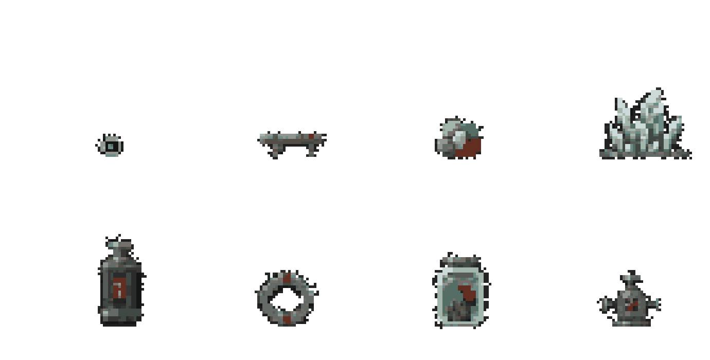

# 《坠星余烬》星际单元设定集：井星

> 版本：V0.3  
> 单元类型：起始星球／矿业遗星／多层坠井生态  
> 上游基线：《游戏设计总纲 V0.5》《文案设计手册 V0.5》《V0.6 Markdown 设定集》  
> 内容范围：星体结构、地形区域、遗迹、建筑、NPC、生物、材料、常见物品、生态关系与视觉规范  
> 边界：井星篇四条离星路线已经冻结；本文补全世界内容，不改写既有剧情结论

## 版本标记

- **冻结继承：**井星篇既有事件、砾／简七／照临三名核心角色、四条离星路线、拔核倒计时与“只能小规模救援”等内容。
- **本册固化：**井星空间结构、区域关系、环境法则、视觉语言以及既有名词的具体落地方式。
- **新增候选：**次要居民、扩展生物、部分建筑和常见物品。它们服务于区域密度与生态闭环，可在进入关卡生产前调整，但不得推翻冻结继承项。
- **V0.2视觉冻结：**常规成年人约20原生像素高；怪物与物品不按格子等比放大，而按相对于人物的世界尺度绘制。
- **V0.3资产重建：**正式图片已转换为透明背景、二值Alpha与固定调色板的严格网格像素资产；比例、画布和主体设计沿用V0.2审核结果。

---

# 1. 单元总览

## 1.1 一句话定义

> **井星是一颗被历代采掘掏成同心深井的矿星：居民不生活在地表，而生活在井壁、支梁、压力层和不断改变方向的“下方”之间。**

井星必须让玩家形成三个第一印象：

1. 这里不是一座建在洞穴里的城，而是一颗已经被挖空的星球。
2. 建筑、生态与日常习惯都围绕“下方可能改变”建立。
3. 世界破坏不是剧情演出；水、梁、菌丝、燃海和坠核确实会一起改变。

## 1.2 叙事与体验职责

| 职责 | 玩家应获得的认识 |
|---|---|
| 世界规则入门 | 水、沙、血、气体、尸体与建筑都是可改变的物质 |
| 重力入门 | “下方”是局部法则，不是永远固定的屏幕底部 |
| 星种入门 | 微型引力可以吸附环境物质，构筑不是抽象法术 |
| 物化入门 | 血液滋养菌丝，菌丝燃烧成为孢子与矿物灰 |
| 文化入门 | 五行是变化过程；地维是维持共同下方的物理结构 |
| 道德入门 | 取走坠核既是力量来源，也会真实拆掉一个世界的下方 |

## 1.3 星体档案

| 项目 | 设定 |
|---|---|
| 正式名称 | 井星 |
| 当地口语 | 老井、井里、下层、壳外 |
| 弃用名称 | 阿刻戎，不再作为正式或古代名称使用 |
| 星体类型 | 小型高密度矿星，内部大面积人工掏空 |
| 聚落形态 | 井壁悬挂聚落、支梁平台、压力舱群、废弃采掘层 |
| 主要坠律 | 大范围指向坠核；断维区出现壁向、井心向与周期漂移 |
| 主要生态 | 菌丝—孢潮—血土循环；燃海与热雾生态；上升兽季节迁徙 |
| 主要产业 | 矿物采掘、冷石加工、旧设备维修、孢体与燃海收集 |
| 当前人口 | 无全星精确统计；聚落分散，失联者不能自动计作死亡 |
| 当前危机 | 支撑结构老化、坠律裂隙扩张、旧产业衰亡、外部势力调查坠核与见证 |
| 法则见证 | 可在特定古炼室、见证匣与坠核状态下取得；归入“重力与方向” |

---

# 2. 外观与星体结构

## 2.1 从太空观察

井星不是完整光滑的球体。

- 外壳呈焦黑、铁锈红和灰白相间的矿物带。
- 北半球有一处巨大的人工井口，边缘分布废弃吊架和断裂轨道。
- 若井星仍稳定，尘埃会沿壳面缓慢汇向井口附近的旧采掘沟。
- 若坠核受损，尘埃会形成数条互相冲突的物质尾，像星球正在向不同方向散开。
- 上升兽迁徙季可以看到极淡的热雾柱穿出井口，轨道巢月上出现孢光。

井星远景不应像一颗有巨大圆洞的普通行星。它更像一枚被反复开凿、修补、再开凿的矿物器官。

## 2.2 星体纵剖面

```text
                    轨道巢月／旧观测残骸
                              ↑
                       上升兽迁徙通道
                              │
        ┌────────────── 壳外采掘环 ──────────────┐
        │                  古发射井                 │
        │                     │                     │
        │              上层排液与光雾层             │
        │                     │                     │
        │       维修层 ── 主井居住带 ── 旧船坞       │
        │          ╲          │          ╱          │
        │        废弃生态站  古炼室   上升兽巢腔      │
        │              ╲      │      ╱              │
        │             断裂地维柱／重力裂隙            │
        │                     │                     │
        │          冷石棚层 ─ 燃海导管区              │
        │                     │                     │
        │               坠核抽取台                   │
        │                     │                     │
        └───────────────── 坠核 ─────────────────┘
```

剖面只表示叙事关系，不代表玩家只能从上向下移动。局部坠律会让井壁、井心与横向支梁分别成为“地面”。

## 2.3 星体分层原则

| 层级 | 视觉感受 | 主要物质 | 生活状态 |
|---|---|---|---|
| 壳外层 | 低压、强光差、废弃工业剪影 | 风化铁岩、光雾、壳尘 | 极少常住者，多为采集与观测设施 |
| 上井层 | 轻质物上浮，排液渠密集 | 光雾、孢子、冷凝水 | 巢腔、排气站、旧发射设施 |
| 中井层 | 建筑最密集，梁与管道交错 | 铁砂、维修合金、生活水 | 主要居民、维修层、旧船坞 |
| 生态层 | 潮湿、活性高、废弃实验多 | 菌丝、血土、息壤、孢潮 | 简七驻留，少量幸存者和失控生态 |
| 古炼层 | 石、陶、金属与仪式结构混合 | 五色石、矿物灰、导体晶体 | 照临驻留，保存井星见证线索 |
| 深井层 | 高温、高压、坠律不稳定 | 重液、燃海、冷石、金属砂 | 少量轮班工与自动设施 |
| 核层 | 方向不断加强，建筑围绕核心弯曲 | 高坠性材料、补维石、核心外壳 | 抽取台与最后校正设施 |

---

# 3. 环境法则

## 3.1 坠律

正常区域的物质大体向坠核下落，但井星内部空腔巨大，旧地维柱又被多次截断，因此存在四种常见局部状态：

| 状态 | 表现 | 对生活的影响 |
|---|---|---|
| 核向坠律 | 向星体中心坠落 | 最接近日常意义的“下方” |
| 壁向坠律 | 向某一侧井壁下落 | 房屋直接建在垂直井壁上 |
| 井心坠律 | 向空腔中心下落 | 漂浮物汇成危险物质团，桥梁必须绕开中心 |
| 漂移坠律 | 下方缓慢转动或突然跳变 | 居民依赖固定钉、方向铃和多面地板生活 |

井星居民不会说“重力反了”，而会说“下方换了”“这层开始往壁上落”。

## 3.2 空气与气候

- 星体内部空气主要依靠旧循环井、菌丝生态和人工压力门维持。
- 井口附近低压，深层则因热雾和燃海气泡形成高压区。
- 光雾沿低坠性通道上浮，冷却后会凝成发光粉滴重新下坠。
- 孢潮既是天气也是迁徙：成熟菌丝燃烧、重力翻转或上升兽出巢都会造成孢子大规模移动。
- 大型爆燃不会只造成火焰伤害，还会改变压力、孢潮方向和燃海液面。

## 3.3 温度分布

| 区域 | 常态 | 变化来源 |
|---|---|---|
| 壳外 | 极冷 | 初炉熄灭后的宇宙低温、井内排热 |
| 居住层 | 冷凉 | 生活炉、管线和拥挤聚落提供局部热源 |
| 生态层 | 温湿 | 生物代谢、菌丝活动与废弃实验设施 |
| 燃海层 | 高温且波动 | 气泡破裂、可燃蒸气与旧开采管线 |
| 坠核层 | 低温外壳包围高能结构 | 冷石棚与补维设施长期压制核心热量 |

---

# 4. 主要区域设定

## 4.1 回响棺厅

**位置：**中上井层的一处封闭旧设施。  
**视觉：**狭长金属棺列嵌入岩壁，银白冷凝水沿黑色外壳流动；大多数棺体为空，编号被磨去。  
**物理特征：**局部坠律稳定但轻微脉动；棺门开启时冷气会使光雾凝结下坠。  
**可见内容：**玩家旧尸、身份空白屏、棺后铭文、排液板、第一件引核星种。  
**环境叙事：**设施曾经接收过不止一个同形者；居民没有能力解释，只知道井底偶尔会“吐出一个人”。

## 4.2 排液井与轻雾层

**位置：**回响棺厅外侧至上井层。  
**视觉：**多层水槽、倾斜闸板和被光雾照亮的细雨。  
**主要玩法物质：**重液、清水、光雾、铁砂。  
**危险：**错误破坏排液板会让重液淹没下层；点燃光雾可能沿通风井回火。  
**生活痕迹：**居民用水流判断当班的下方；闸门旁的箭头经常被重新涂画。

## 4.3 维修层与主井居住带

**位置：**中井层，多条主梁交叉处。  
**视觉：**房屋、铺位、维修架和小型压力舱直接焊在承重梁上；不同建筑拥有不同地板方向。  
**核心人物：**砾，以及老栓在内的3～5名砾熟悉的维修居民。  
**主要设施：**旧船坞、固定钉库、冷却管网、方向铃、公共炉。  
**危险：**漏水改变梁体受力；金属疲劳会随坠律跳变突然释放。  
**生活细节：**家具至少有两个固定面；杯子底部带插销；睡铺像能从四面合拢的布袋。

## 4.4 废弃生态站

**位置：**中下井层的高湿支洞。  
**视觉：**编号整齐的玻璃舱、破裂培养管、被血土顶开的白色地砖；只有简七的个人物品没有编号。  
**核心人物：**简七；原有十二名研究员，当前只有简七能稳定回应。  
**主要物质：**菌丝、血土、息壤、冷藻、孢体、保存液。  
**危险：**尸体流血会扩大菌丝；息壤遇水堵塞通道；成熟菌丝燃烧形成孢潮。  
**环境叙事：**研究站不是被怪物突然毁掉，而是一次错误分类让清理系统把正在形成的生态当成污染。

## 4.5 古炼室

**位置：**生态层与深井层之间，建在旧矿脉交汇处。  
**视觉：**陶质炉壁、青铜锈色导管、星盘式轨道槽和矿物沉积共同组成巨型反应器；没有中式屋檐。  
**核心人物：**照临及附近收容居民。  
**主要内容：**水→生长→燃烧→沉积→结构的古代变化图式；井星见证匣；曜廷调查记录。  
**危险：**玩家若把五行误当五种材料，错误投料会形成爆燃、堵塞或导电失控。  
**环境叙事：**古人不是用神秘力量炼星，而是以另一套语言记录真实反应过程。

## 4.6 断裂地维柱

**位置：**古炼层通向核层的必经大空腔。  
**视觉：**一根横贯空腔的巨大柱体在中央断开，两截拥有不同“下方”；五色复合矿沿裂口像结痂般生长。  
**主要物质：**五色石、弱水微流、铁砂、断柱陶岩。  
**危险：**跨过裂隙时角色、液体和投射物会转向；上层水正沿新下方持续流失。  
**环境叙事：**这里先用地形解释“地维”，之后铭文才给它名字。

## 4.7 冷石棚层与燃海导管区

**位置：**深井层。  
**视觉：**冷石像苍白骨片嵌在黑岩中，下面是透出暗红气泡的燃海；旧导管横跨液面。  
**主要资源：**冷石、可燃液、导体矿、耐热巢膜。  
**危险：**金属星种可能吸起导管碎片刺破燃海气泡；冷石破碎会让被压制热量集中释放。  
**用途：**修复旧船所需三类功能材料主要从此获得，但不存在唯一原装零件。

## 4.8 上升兽巢腔

**位置：**上井层和深层热流相连的纵向空腔。  
**视觉：**半透明囊膜附着井壁，内部可见热雾、卵与缓慢收缩的肌肉纤维；巢口朝向低坠通道。  
**主要生物：**上升兽、巢膜虫、食孢微群。  
**危险：**金属钩会刺伤囊翼；负载过高会让迁徙个体坠回燃海层。  
**环境叙事：**它们不是为居民提供交通，而是把井星的部分生态带到轨道巢月繁殖。

## 4.9 旧船坞

**位置：**维修层外缘，靠近一条已废弃的采掘上升道。  
**视觉：**一艘壳体不对称的小型星舟卡在支架间，三条功能回路完全暴露：冷却、导电、点火。  
**主要角色：**砾。  
**设计原则：**玩家寻找的是“能让热走、让电过、让火只烧一次”的兼容材料，而不是三件固定任务物品。  
**世界状态：**过度修复可以增加货位和稳定度，但不会变成强制刷满的进度条。

## 4.10 坠核抽取台

**位置：**核层外壳。  
**视觉：**多环金属平台围绕黑色高密度核心；三组导坠槽分别通向维修层、生态站和古炼室。  
**主要装置：**抽取锁、便携核心架、校正杆、两次确认台、留形锚接口。  
**危险：**抽取锁定后不可逆；井星进入11分40秒全层失稳。  
**撤离限制：**标准撤离只能稳定维修层、生态站、古炼室三条支路中的一条，通常救出3～6名居民及有限物资；最后航路必须由一名现场人员持续校正，不能用自动装置消除留守代价。  
**环境叙事：**它原本就是把世界核心转化为可携带资源的工业设施，不是临时出现的邪恶祭坛。

## 4.11 古发射井

**位置：**壳外层与上井层交界，常规地图不主动标记。  
**视觉：**没有推进器的古老发射舱悬在石环中，三段坠向框架彼此错位；门楣刻着操作性铭文。  
**原理：**暂时把井口改写为局部“下方”，让发射舱向太空坠落。  
**危险：**暴力破门只能进入旧舱；不改变坠向，舱体会重新砸回井底。  
**代价：**成功启动后框架烧毁，本轮古发射井失效。

## 4.12 壳外采掘环与轨道巢月

**壳外采掘环：**风化严重的露天矿带，低压、低温，保留早期井星尚未被完全掏空时的设备。  
**轨道巢月：**由旧观测残骸、岩块、巢膜和上升兽卵组成的小型混合天体。  
**作用：**上升兽路线的落点、囊舟材料来源，也是玩家第一次站在井星之外观察这颗星球的地点。

---

# 5. 常见地形单元

| 地形 | 外观与材质 | 主要行为 | 常见区域 |
|---|---|---|---|
| 井壁陶岩 | 焦黑岩层夹灰白烧结带 | 坚硬但受热差异大时片状爆裂 | 全层 |
| 疲劳支梁 | 锈红金属与多次焊补痕 | 承重改变后回弹、弯折或断裂 | 维修层、船坞 |
| 铁砂坡 | 黑银颗粒堆积 | 被引核吸附，易形成高速环流 | 排液层、深井层 |
| 重液池 | 黑色高坠性液体 | 受热分层，上层蒸气可能燃烧 | 中下井层 |
| 光雾烟囱 | 青白气溶胶聚集带 | 上浮、可燃，冷却后凝滴下坠 | 上井层 |
| 血土床 | 暗红潮湿土层 | 活性、记性较高，促进菌丝生长 | 生态层 |
| 息壤塞 | 灰绿活性土团 | 遇水增殖，受火暂时抑制 | 生态站、漏水区 |
| 冷石棚 | 苍白晶石层 | 长期吸热，破坏后释放温差 | 深井层 |
| 燃海薄层 | 暗红液体与亮橙气泡 | 可燃、挥发、受压爆燃 | 深井层 |
| 补维矿痂 | 朱砂、汞银、玉青等多相矿物 | 暂时稳定重力裂隙 | 断裂地维柱 |
| 弱水细流 | 表面反常平直的透明液体 | 对坠律响应异常，穿越裂隙时轨迹难判 | 古遗迹附近 |
| 孢潮带 | 灰绿发光孢子云 | 随气流和坠律迁徙，可传播生态与火焰 | 生态层、巢腔 |

---

# 6. 建筑与设施

## 6.1 井壁住宅

- 房间通常拥有两至三个可作为地板的加固面。
- 门不是统一朝上，而是朝向相对稳定的支梁或公共走道。
- 家具使用固定扣、插销杯和网袋柜，不放置纯装饰性散物。
- 贫困住宅直接使用矿道旧支架；较新住宅则有独立微型定向板。

## 6.2 锚屋

建在重力裂隙附近的小型避难建筑。内部没有固定桌椅，四壁都有把手、软垫和物资袋。坠律跳变时居民先进入锚屋，而不是试图站稳。

## 6.3 维修桥

跨越主井的模块化梁桥。桥面只是其中一个行走面，底部与侧面同样有维修轨和固定孔。桥梁被破坏后，残件会成为真实坠落物和可利用金属材料。

## 6.4 压力门与公共气闸

井星最常见的公共建筑单元。压力门两侧通常拥有不同空气密度、温度甚至下方。居民开门前会先看水珠、悬丝和方向铃，而不是只相信仪表。

## 6.5 公共炉与冷却井

居民用燃海蒸气供热，用冷石井控制温度。两者靠得太近会造成材料疲劳；离得太远则浪费导管。因此公共炉常成为聚落争执与维修任务的中心。

## 6.6 见证匣

用于保存井星法则见证或其空位记录的多层容器。它不是宝箱：

- 外层记录来源与取得方式。
- 中层维持微型稳定坠律。
- 内层保存见证结构。
- 空匣仍然能证明见证曾被取走或从未完成。

## 6.7 留形锚

拔核后人工维持最后一条稳定航路的校正设施。需要现场观察每一次结构断裂，无法完全自动化。它保存方向脉冲和操作痕迹，但不能重建留守者人格。

---

# 7. 内部遗迹

| 遗迹 | 年代与来源 | 核心发现 | 可利用内容 |
|---|---|---|---|
| 回响棺列 | 年代早于当前聚落 | 多个同形身体与空棺，身份连续性未知 | 回响记录、冷凝材料、身体记性 |
| 古炼室 | 初炉仍运行的旧时代 | 五行记录的是变化链而非属性 | 导体晶体、古图式、人造律印知识 |
| 断裂地维柱 | 关炉前后均被修补 | 世界的共同下方可以被切断与局部维持 | 五色石、弱水、坠律记录 |
| 关炉中继残室 | 隐藏于古炼室后部 | 初炉并非自然熄灭，多个世界共同撤回其下 | 低温残讯、关闭记录碎片 |
| 坠核抽取台 | 后期采掘文明 | 井星曾准备把自身核心工业化转运 | 便携核心架、导坠槽、抽取模型 |
| 古发射井 | 旧星官航行时代 | “向上飞”可以被改写成“向外坠落” | 坠向框架、星图残片、知识出口 |
| 壳外观测站 | 早期采矿时期 | 井星曾拥有更多地表生活区 | 星体旧剖面、巢月轨道、天气记录 |
| 废弃生态站 | 近代无重学会 | 分类与清理制度曾把新生态当污染 | 种库、实验记录、失效人造律印样本 |

---

# 8. NPC设定

## 8.1 核心角色

### 砾

| 项目 | 内容 |
|---|---|
| 身份 | 井星维护工，长期负责中层承重、排液与旧船 |
| 初始位置 | 维修层漏水梁附近 |
| 外观 | 短厚防护衣、多处手工补片；工具固定在身体两侧；头盔缺一块护面但加装方向铃 |
| 色彩 | 铁锈红、焦黑、旧铜与少量安全白 |
| 行动习惯 | 说话时继续维修；先看梁、水和人站在哪里，再看对方身份 |
| 表层目标 | 修好旧船，让能离开的人离开，同时不轻易拆掉井星 |
| 盲点 | 擅长保存眼前具体的人，却回答不了宇宙长期降温 |
| 语言 | 短句、劳动比喻、具体后果；极少使用古称和制度词 |
| 代表物 | 旧固定钉、维修扳杆、老栓的红杯子 |
| 路线关系 | 修船路线自然同行；拔核路线可能留守、获救、同行、失联或死亡 |

### 简七

| 项目 | 内容 |
|---|---|
| 身份 | 无重学会外勤研究员，废弃生态站最后的稳定回应者 |
| 初始位置 | 菌丝实验区与清理门之间 |
| 外观 | 灰白分层实验服、透明样本盒、可折叠测序镜；衣物规整，靴底却长期沾有血土 |
| 色彩 | 汞银、冷灰、玉青与警示黄 |
| 行动习惯 | 先看读数再看人；发现错误时会明确修正记录，不用含糊道歉替代事实 |
| 表层目标 | 记录反应链、坠核失稳与回响体数据，保存仍可验证的证据 |
| 盲点 | 容易把人降为样本和误差，必须学习“准确记录”不等于“拥有解释权” |
| 语言 | 克制、条件化、区分确认与推测；建立信任后逐渐使用玩家姓名 |
| 代表物 | 样本盒、误差记录板、未编号的个人杯、生态观测索 |
| 路线关系 | 上升兽路线自然同行；拔核时可负责生态支路或留形锚校正 |

### 照临

| 项目 | 内容 |
|---|---|
| 身份 | 曜廷巡火员，负责确认井星见证与初炉遗迹 |
| 初始位置 | 古炼室入口与反应炉之间 |
| 外观 | 庄重的曜廷披挂被矿尘遮住大半；礼制结构下穿着实际耐热工作服；印章可拆下作为机械限位件 |
| 色彩 | 朱砂红、暗金、焦黑、少量玉青 |
| 行动习惯 | 先修复古炉再整理礼服；越熟悉井星，越少用抽象的“必要代价” |
| 表层目标 | 寻找井星见证，确认初炉关闭记录，并保留复火所需知识 |
| 盲点 | 相信宇宙必须恢复循环，容易把具体世界纳入未来尺度 |
| 语言 | 庄重完整，常把事实放进制度语句；人物弧线是重新把“有人”写成具体名字 |
| 代表物 | 曜廷印章、见证匣、古炼室清理刷、私人姓名便笺 |
| 路线关系 | 古发射井路线自然同行；拔核时可负责古炼室支路或主动留守 |

## 8.2 井星居民

老栓继承自既有文案；芦灯、拂灰和苔罐为本册新增候选居民。三人均不得抢占核心角色的主线职责。

### 老栓

- 维修层老工人，腿部曾被回弹支梁压伤。
- 红杯子固定在维修层一根不起眼的钉上，是居民判断旧方向是否仍然存在的日常物。
- 不负责解释主线；存在意义是让“维修层还有四个人”变成具体生活。
- 获救后第一句话先问红杯子，不立即赞颂牺牲者。

### 芦灯

- 上井层巢腔采集者，收集脱落巢膜、冷却孢粉和上升兽空卵壳。
- 相信上升兽不是交通工具，反对用金属钩刺穿囊翼。
- 可以教玩家制作柔性附着带，但不会保证迁徙安全。
- 若死亡或缺席，巢壁抓痕、断裂金属钩与迁徙记录仍能传达必要信息。

### 拂灰

- 古炼室附近的矿物沉积工，负责把反应灰压成可用导体。
- 只能读懂古图式的劳动含义，不理解曜廷历史。
- 口头习惯：“先看它怎么变，再问古人叫它什么。”
- 拔核救援中属于古炼室居民，不因见证存在而获得更高救援优先级。

### 苔罐

- 生态站幸存培养员，负责冷藻与井层微生物种库。
- 认为种库是离开者未来生活的一部分，但不会说样本比活人重要。
- 身上携带密封生态罐；罐体破裂会形成小型污染事件，而不是普通任务失败标记。

## 8.3 NPC使用原则

- 三名核心角色不是三个道德按钮，他们分别放大具体生活、可验证事实和宇宙未来。
- 一轮标准流程只让一名角色成为高频同行者。
- NPC死亡不生成替身；操作事实由环境与记录保留，关系和私人解释永久损失。
- 井星居民没有义务等待玩家。长期停留时，他们会修门、转移物资、争吵、受伤或自行尝试离开。

---

# 9. 生物与生态

上升兽与菌丝群落继承既有路线和反应设定；其余生物为本册新增的基础生态候选，用于把物质反应转化为可观察的食物链、预警与迁徙行为。

## 9.1 上升兽

| 项目 | 设定 |
|---|---|
| 类型 | 大型囊翼迁徙生物 |
| 栖息地 | 上井层巢腔，繁殖期沿热雾柱前往轨道巢月 |
| 外观 | 扁长身体、半透明耐热囊翼、腹部多枚低坠卵囊；没有可供骑乘的天然鞍部 |
| 运动 | 吞入热雾与低坠孢群，通过囊翼改变整体坠性；看似飞行，实为沿不断变化的下方迁徙 |
| 生态作用 | 将孢子、微生物与矿物带到轨道巢月，形成跨星体生态循环 |
| 对玩家 | 不主动救援、不接受驯化；玩家只能以柔性材料附着并控制自身负载 |
| 死亡后果 | 囊内热雾外泄，卵体与巢膜成为材料；迁徙路线不会立刻刷新替代个体 |

## 9.2 沉浆鳗

- 生活在重液池分层界面，身体上半部低坠、下半部高坠。
- 捕食时让猎物跨过液体分层并失去稳定方向。
- 受热后会随重液分层，被迫暴露柔软腹部。
- 尸体可提取坠性不同的两种胶质，是早期星种过滤材料。

## 9.3 钉足兽

- 小型六足金属摄食生物，足端能插入井壁孔洞。
- 以锈屑、导线和矿物盐为食，会拆走玩家刚接好的低质量线路。
- 坠律翻转时通常比玩家更稳定，因此可以通过其足向预判下一次方向变化。
- 受到强磁性或引核星种影响时会聚成危险的金属团。

## 9.4 巢膜虫

- 上升兽巢腔中的扁平共生虫，清理囊膜表面的真菌和金属粉。
- 遇火收缩成耐热薄片，可用于柔性护层。
- 大量死亡会使巢膜感染，改变上升兽迁徙路线。

## 9.5 囊灯孢群

- 不是单一生物，而是光雾中共同漂浮的发光孢体群。
- 冷却后凝成黏性亮滴；受热则迅速扩散并可能引燃光雾。
- 上升兽幼体以其为方向信号和部分食物。
- 玩家可以用它照明，也可能因此暴露位置或制造孢潮。

## 9.6 梁听螨

- 寄生在疲劳支梁内部，以金属氧化层为食。
- 群体会在梁即将断裂前迁向低应力区，形成细小沙沙声。
- 维修工把这种声音当作辅助判断，仪器则常把它当成噪声。
- 烧死螨群能短暂清理支梁，却失去提前预警，并加速局部热疲劳。

## 9.7 菌丝群落

- 井星最重要的基础生态，不统一视为敌人。
- 吸收血液和养分生长，成熟后可燃；燃烧释放孢子与矿物灰。
- 与息壤结合可以修补结构，也可能堵死气闸与排液渠。
- 菌丝记性较高，会沿曾经有血液或热量的位置重新生长。

## 9.8 生态关系链

```text
生活水／漏水
      ↓
   息壤增殖 ─────→ 堵塞建筑
      ↓
血液 → 菌丝生长 → 成熟菌丝燃烧 → 孢潮＋矿物灰
             ↑                         ↓
          尸体物化              囊灯孢群／上升兽

重液分层 → 沉浆鳗捕食 → 双坠胶质

锈屑／导线 → 钉足兽 → 金属团聚 → 梁与线路损坏

疲劳支梁 → 梁听螨迁徙 → 维修工提前发现断裂
```

---

# 10. 常见材料

| 材料 | 识别特征 | 主要性质 | 常见用途与风险 |
|---|---|---|---|
| 重液 | 黑色、流速慢、明显沉底 | 高坠性，受热分层 | 配重、坠性构筑；上层蒸气可能燃烧 |
| 光雾 | 青白发光气溶胶 | 低坠性、可燃、冷凝 | 照明、轻质反应；可能沿通风井回火 |
| 铁砂 | 黑银颗粒 | 导电、易被引核吸附 | 早期星种材料；高速环流会切割物体 |
| 菌丝 | 灰绿或苍白丝状物 | 吸收体液、成长、可燃 | 生态培养、燃料、反应链；可能蔓延 |
| 血土 | 暗红潮湿土 | 活性与记性升高 | 培养、追踪死亡痕迹；容易失控生长 |
| 息壤 | 灰绿活性土团 | 遇水增殖、火焰抑制 | 修补裂缝；也会吞没通道 |
| 五色石 | 朱砂、汞银、玉青等多相矿 | 暂时稳定坠律裂隙 | 补维、星炼；不是五种属性宝石 |
| 弱水 | 透明但表面反常稳定 | 坠性异常 | 改变轨道、减重；路径难预测 |
| 冷石 | 苍白骨状晶矿 | 吸热并长期低温 | 船体冷却、抑制活性；破碎导致温差释放 |
| 燃海液 | 暗红液体与亮橙气泡 | 可燃、挥发、高压 | 一次性推力、爆燃；不是岩浆 |
| 矿物灰 | 菌丝燃烧后的细灰 | 可沉积、可压缩 | 制作导体晶体与外壳材料 |
| 巢膜 | 半透明柔性组织 | 耐热、缓冲、不易刺穿 | 上升兽附着带、软护层；可能携带孢体 |
| 双坠胶 | 沉浆鳗体内两相胶质 | 两部分坠性不同 | 过滤、定向连接；混合后可能自发分层 |

---

# 11. 常见物品

## 11.1 工具与生活物

| 物品 | 外观 | 功能与叙事 |
|---|---|---|
| 旧固定钉 | 粗短多齿金属钉，尾部带布环 | 固定玩家和物资；砾用它代替长篇欢迎 |
| 方向铃 | 多轴小铃，分别朝不同面悬挂 | 哪一面先响，说明下方正在转向哪一侧 |
| 插销杯 | 杯底有旋入式固定座 | 井星最普通的生活物；老栓红杯子是私人版本 |
| 多面睡袋 | 四面都有绑带与缓冲层 | 下方改变时无需重新布置床铺 |
| 排液扳杆 | 长柄、非对称配重 | 操作压力门，也可作为近战工具和临时支撑 |
| 生态密封罐 | 双层透明罐、内部微型方向板 | 保存种样；破裂后会释放真实生态材料 |
| 柔性附着带 | 巢膜与纤维编成 | 上升兽路线必需功能之一，不伤害囊翼 |
| 见证匣 | 多层环形容器 | 保存井星见证或空位记录，不等于普通宝箱 |

## 11.2 构筑与任务物

| 物品 | 类型 | 作用 |
|---|---|---|
| 引核星种 | 初始构筑 | 释放微型引力，优先吸附铁砂等兼容物质 |
| 导体晶体 | 反应产物 | 由矿物灰压缩形成，可修船或建立导电路径 |
| 冷却骨片 | 冷石加工物 | 提供稳定吸热面，体积小于原矿但容量有限 |
| 燃海罐 | 密封燃料容器 | 提供一次可控点火；破损会泄漏可燃蒸气 |
| 补维片 | 五色石压片 | 临时稳定小型裂隙，无法永久修复坠核 |
| 便携坠核架 | 抽取设备 | 只在拔核后承载井星坠核，重量与方向影响明显 |
| 留形锚签 | 校正记录件 | 记录谁维持最后下方及其方向脉冲，不保存人格 |
| 关闭记录残片 | 古发射井资料 | 证明初炉被主动关闭；信息完整度受路线影响 |

---

# 12. 物质与生态事件

## 12.1 常见自然事件

| 事件 | 触发 | 结果 |
|---|---|---|
| 小型孢潮 | 菌丝燃烧、通风改变 | 能见度下降，孢体扩散，上升兽活动增加 |
| 下方漂移 | 地维裂隙周期变化 | 液体改道，建筑载荷变化，隐藏通道开启或关闭 |
| 燃海吐泡 | 压力升高或导管破裂 | 可燃气泡进入上层，遇火形成连锁爆燃 |
| 冷石落棚 | 支撑层升温 | 冷石大片剥落，局部急冷并压碎下方结构 |
| 梁鸣 | 梁听螨迁徙、金属应力积累 | 提供断裂预警，也可能吸引钉足兽 |
| 轻雾雨 | 光雾遇冷凝结 | 发光液滴重新下坠，短暂照亮隐藏矿脉 |

## 12.2 玩家制造的典型事件

- 用引核星种吸附铁砂，意外把钉足兽和导线一起卷入轨道。
- 引水接触息壤，修补一处裂缝，却堵住下层排液渠。
- 用血液催生菌丝，再点燃形成孢潮，为上升兽制造迁徙窗口。
- 打碎冷石压制燃海爆燃，同时让附近活性生态进入休眠。
- 用五色石暂时封住断维，改变水流并开放新的步行面。
- 反转古发射井坠向，让舱体向外“下落”。

---

# 13. 世界状态变体

## 13.1 稳定井星

- 坠核在位，主井坠律仍可维持。
- 维修层、生态站和古炼室继续各自工作。
- 玩家可以回访，收到维修广播、研究记录与曜廷观察。
- 稳定不等于问题解决：资源衰退与宇宙降温仍然存在。

## 13.2 受创井星

- 玩家破坏局部核心、抽取台外壳或发射井，但没有完整拔核。
- 重力裂隙扩大，部分聚落迁移，资源区重新分布。
- 井星仍可回访，却出现新的方向灾害和政治争论。

## 13.3 无核井星

- 坠核被取走，星体分裂为多方向残层。
- 只能接近幸存残块、留形锚脉冲与部分轨道物质尾。
- 11分40秒不能被回访或跨周目知识倒转。
- 被救出的人、物种和记录不会抵销原世界毁灭。

## 13.4 未知井星

- 玩家以极端路线离开，或信息链断裂，无法确认整体状态。
- 系统只写“生命信号无法定位”，不自动宣告全员死亡。
- 后续可能通过残讯、难民、材料或势力报告逐步确认。

---

# 14. 视觉设计规范

## 14.1 总体风格

- 二维低分辨率、高信息密度像素风；形体先可读，再在剩余像素预算内添加表面信息。
- **角色像素标尺：**常规成年人站立高度约20个原生像素；设定图使用64×64比较画布，头顶至鞋底控制在约19～21像素。脸部通常只有一块肤色与一个暗像素，身份依靠轮廓、主色和单件大工具区分。
- **生物尺度不是统一格子：**钉足兽约27～31×14～18像素；沉浆鳗弯曲姿态约44～50×26～32像素；上升兽约54～58×28～32像素。三者与人物使用同一像素密度，但体量可以远大于人物。
- **环境像素标尺：**区域概念单格使用160×90原生像素；优先表现可行走面、液体路径、承重结构和重力方向，不能依靠高分辨率纹理解释空间。
- **物品像素标尺：**物品保存在64×64世界比例画布中，但实体本身不填满画布。掌中小件约5～8像素，单手容器约8～11像素，燃海罐约9×13像素，冷石矿簇约15×13像素。拾取闪光和背包图标可另做放大版本，不能反过来改变世界实体尺寸。
- 放大预览只允许整数倍最近邻显示，不使用平滑缩放、抗锯齿或“高清图叠像素滤镜”。
- 建筑必须表现材料拼接、受力方向、维修痕迹与可破坏性。
- 中国文化通过鼎炉、星盘、璧、天柱、矿物色和变化图式进入结构。
- 禁止堆叠中式屋顶、灯笼、龙纹、符纸和泛古风服装。
- 不直接复制任何现有游戏的具体角色、怪物、UI或场景构图。

## 14.2 色彩

| 色彩 | 用途 |
|---|---|
| 焦黑 | 井壁、旧设备、被烧结岩层 |
| 铁锈红 | 维修层、旧工业、生活设施 |
| 汞银 | 回响棺、学会设备、冷凝面 |
| 玉石青 | 光雾、坠律读数、低温材料 |
| 朱砂红 | 曜廷结构、危险热源、古炼标记 |
| 灰绿 | 菌丝、息壤、孢潮 |
| 苍白骨色 | 冷石、老化陶岩、死亡残层 |

## 14.3 形状语言

| 对象 | 形状语言 |
|---|---|
| 井星居民建筑 | 梁、钉、网、可翻转多面空间 |
| 古代遗迹 | 圆环、断柱、鼎腹、轨道槽 |
| 曜廷设施 | 对称外框、明确中心、被现场维修破坏的礼制形 |
| 学会设施 | 编号容器、透明观察面、可拆测量臂 |
| 生物 | 囊膜、分层身体、抓壁结构、对坠律的可视适应 |
| 坠核设施 | 多环包围、方向线汇聚、结构向中心弯曲 |

## 14.4 声音

- 主环境声：金属承压、滴水、远处断裂、气流与液体沸腾。
- 维修层：敲击、扳杆回弹、方向铃。
- 生态层：湿润摩擦、孢囊破裂、菌丝燃烧的细密爆声。
- 古炼室：石击、低沉钟磬、矿物共振，不使用古筝笛子直接宣布“中国风”。
- 坠核层：低频方向脉冲与失去基音的长钟声。

---

# 15. 概念图资产表

本册正式图像为**透明背景、硬边Alpha、原生低分辨率、统一世界尺度像素资产**：环境单格160×90；NPC／生物使用64×64比较画布，其中人物约20像素高、怪物按真实体量扩展；物品使用64×64世界比例画布。V0.3程序在不改变已经审核的相对尺寸与主体位置的前提下，移除生成底板、收敛调色板，并保证Alpha只有0／255两档。

## 15.1 环境与建筑母版

母版：`assets/master/井星_环境建筑母版.png`


| 裁切顺序 | 单图文件 | 内容 |
|---:|---|---|
| 01 | `assets/split/env_01_星体剖面.png` | 井星纵剖面与多层坠井结构 |
| 02 | `assets/split/env_02_维修层.png` | 维修层与井壁住宅 |
| 03 | `assets/split/env_03_生态站.png` | 废弃生态站与菌丝失控 |
| 04 | `assets/split/env_04_古炼室.png` | 古炼室与变化链结构 |
| 05 | `assets/split/env_05_断裂地维柱.png` | 双向重力裂隙 |
| 06 | `assets/split/env_06_上升兽巢腔.png` | 囊膜巢与热雾迁徙通道 |
| 07 | `assets/split/env_07_坠核抽取台.png` | 坠核、三组导坠槽与抽取环 |
| 08 | `assets/split/env_08_古发射井.png` | 反向坠落式发射设施 |

## 15.2 NPC与生物母版

母版：`assets/master/井星_NPC生物母版.png`


| 裁切顺序 | 单图文件 | 内容 | 世界尺度参考 |
|---:|---|---|---|
| 01 | `assets/split/char_01_砾.png` | 井星维护工砾 | 约20 px高 |
| 02 | `assets/split/char_02_简七.png` | 无重学会研究员简七 | 约20 px高 |
| 03 | `assets/split/char_03_照临.png` | 曜廷巡火员照临 | 约20 px高 |
| 04 | `assets/split/creature_01_上升兽.png` | 囊翼迁徙生物 | 约54～58×28～32 px |
| 05 | `assets/split/creature_02_沉浆鳗.png` | 双坠性重液生物 | 约44～50×26～32 px |
| 06 | `assets/split/creature_03_钉足兽.png` | 抓壁金属摄食生物 | 约27～31×14～18 px |

## 15.3 物品与材料母版

母版：`assets/master/井星_物品材料母版.png`



| 裁切顺序 | 单图文件 | 内容 | 世界尺度参考 |
|---:|---|---|---|
| 01 | `assets/split/item_01_引核星种.png` | 初始星种构筑 | 约5×5 px，掌心大小 |
| 02 | `assets/split/item_02_旧固定钉.png` | 砾的固定工具 | 约8×3 px，前臂长度 |
| 03 | `assets/split/item_03_五色石.png` | 多相补维材料 | 约7×5 px，单手矿块 |
| 04 | `assets/split/item_04_冷石矿簇.png` | 膝至腰高的骨状吸热矿簇 | 约15×13 px |
| 05 | `assets/split/item_05_燃海罐.png` | 一次性可燃液容器 | 约9×13 px，膝高 |
| 06 | `assets/split/item_06_见证匣.png` | 多层环形见证容器 | 约8×8 px，单手携带 |
| 07 | `assets/split/item_07_生态密封罐.png` | 菌丝与血土样本 | 约8×11 px，单手携带 |
| 08 | `assets/split/item_08_方向铃.png` | 多轴下方预警装置 | 约7×8 px，可挂壁或挂带 |

---

# 16. 后续生产接口

井星设定集完成后，下一层文档可以分别扩写：

1. **区域关卡包：**每个区域的房间组合、遭遇与物质事件。
2. **生物图鉴包：**动作、生态状态、掉落与《巡天志》正文。
3. **物品文案包：**系统描述、民间叫法、古称与实验追加。
4. **建筑模块包：**井壁住宅、压力门、维修桥等可复用模块。
5. **视觉资产包：**从本次概念母版继续细化角色转面、建筑拆件和像素动画。

后续其他星球、空间聚落、遗迹群与舰队，也应沿用本文件的单元结构：

> 单元总览 → 外观与结构 → 环境法则 → 主要区域 → 地形 → 建筑 → 遗迹 → NPC → 生物 → 材料物品 → 世界状态 → 视觉规范 → 概念资产。
